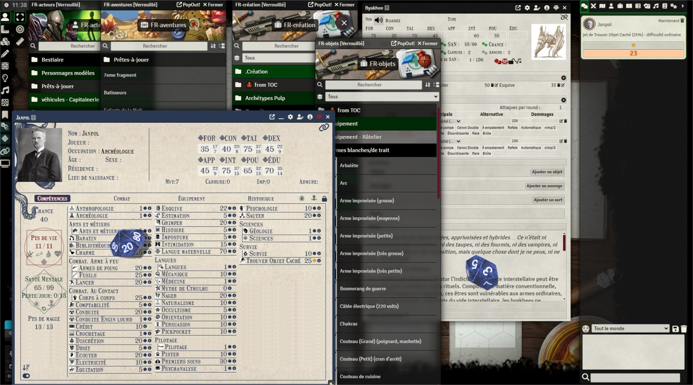

# Call of Cthulhu 7th French (Unofficial)

[Manuel d'utilisation](manuel/manuelcoc7fr.md) 📖

Bonjour.

Installez le module.
Activez-le.
Allez dans le compendium FR-compendiums-journalentries
Ouvrez Doc d'utilisation des compendiums.

https://gitlab.com/vonv/fvtt-coc7-mod-toc-off/-/raw/main/module.json

Bon jeu.