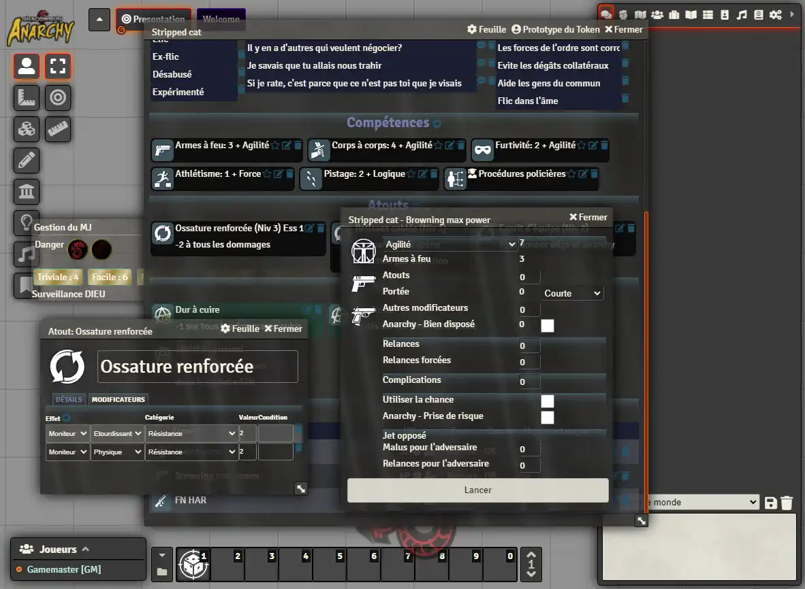

# Welcome to Shadowrun Anarchy

If you are here, you probably know the world has changed, with technology melting with flesh, mythological creatures and magic raising back from the past.

This system implements Shadowrun Anarchy rules for Foundry VTT.

To run a game, you will need the [Shadowrun Anarchy rule book](https://store.catalystgamelabs.com/products/shadowrun-anarchy-pdf), edited by [Catalyst game labs](https://www.catalystgamelabs.com/).

In French, [Shadowrun - Anarchy (VF)](https://www.black-book-editions.fr/produit.php?id=6543), edited by  [Black Book Edition](https://www.black-book-editions.fr/).

## Characters

All characters and opponents are managed almost equal. You may chose different sheet (in the _Sheet_ menu on the header bar): reduced for NPCs, on one page, or with tabs.

Player-owned characters have Anarchy, while NPCs are using the gamemaster's anarchy (even if not displayed on their sheets).

The system supports all you need to play, different type of actors (character, vehicle, device, sprite, and IC), and of items (metatype, skill, qualities, shadow amps, weapons, gear and contacts).

Weapons can be used for regular weapons, for spells, and for matrix attacks (to crash or put marks on target).

Modifiers are available and impact the actual rolls they modify. They can also change monitors, resistances, manage scene anarchy (during combats).

Rolls are started by a click on the name of the weapon/skill/attribute, or on the configurable shortcuts, directly on the token.

When using a weapon, select your target, it will receive a message to defend, with a link to do the roll.

## Gamemaster

The gamemaster has access to a special window which contains:

- Gamemaster's plot points
- Typical difficulty rolls (which can be customized in system options)
- Reminder of GOD surveillance level

When a player character spends anarchy, the GM plot points are increased accordingly.

## Compendiums
No compendiums are provided to not infringe CGL or BBE copyrights, they might develop paying compendiums later.

# Legal mentions

## License

The system is developed under [Creative Commons BY-SA]("http://creativecommons.org/licenses/by/4.0/), more details in [LICENSE.md](LICENSE.md).

 This work is licensed under a <a rel="license" href="http://creativecommons.org/licenses/by/4.0/">Creative Commons Attribution 4.0 International License</a>.

## Trademarks

Shadowrun Anarchy is © 2016 The Topps Company, Inc.

Shadowrun and Matrix are registered trademarks and/or trademarks of The Topps Company, Inc., in the United States and/or other countries.

Catalyst Game Labs and the Catalyst Game Labs logo are trademarks of InMediaRes Productions, LLC. Printed in the USA.

This is a fan project, in no way associated with The Topps Company Inc., Catalyst Games Lab or Black Book Editions.

Ce système Foundry VTT utilise des marques déposées et/ou des droits d’auteurs qui sont la propriété de Black Book Editions et de Catalyst Game Lab, comme l’y autorisent les conditions d’utilisation de Black Book Editions. Ce système n’est pas publié(e) par Black Book Editions / Catalyst Game Lab et n’a pas reçu son aval ni une quelconque approbation de sa part. Pour de plus amples informations sur Black Book Editions, consultez
www.black-book-editions.fr

## Credits & attributions

Icons are derived from original icons provided under [Creative Commons 3.0 BY license](http://creativecommons.org/licenses/by/3.0/), on [game-icons.net](game-icons.net):
- by Lorc
- by Delapouite
- by Skoll

See [game-icons-sources.txt](./game-icons-sources.txt) for the list of used icons, and the original names in case files were renamed.

# The Anarchy development team

- Pretre (Rules insights and contributor)
- VincentVK (Development)
